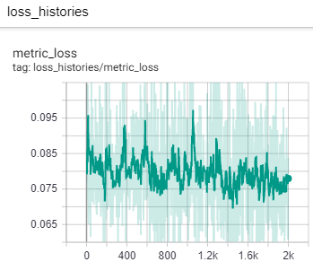
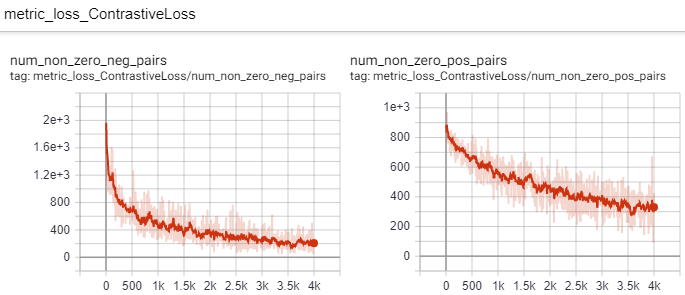
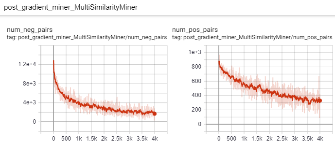

# [A Metric Learning Reality Check](https://arxiv.org/abs/2003.08505)

## [Benchmark results (in progress)](https://drive.google.com/open?id=1Y_stkiqlHA7HTMNrhyPCnYhR0oevphRR): 
- [Spreadsheet #1: Train/val 50/50](https://docs.google.com/spreadsheets/d/1kiJ5rKmneQvnYKpVO9vBFdMDNx-yLcXV2wbDXlb-SB8/edit?usp=sharing)
- [Spreadsheet #2: 4-fold cross validation, test on 2nd-half of classes](https://docs.google.com/spreadsheets/d/1brUBishNxmld-KLDAJewIc43A4EVZk3gY6yKe8OIKbY/edit?usp=sharing)

## See [pytorch-metric-learning](https://github.com/KevinMusgrave/pytorch-metric-learning) for a list of currently available losses, miners, samplers, training methods, and testing methods.

## Why use this tool?
1. Flexibility and power:
    - Configure most aspects of your experiment easily with config files and/or the command-line. Extend existing config files by merging them with new ones, or by merging/overriding config options via the command line.
    - Mix and match losses, mining functions, samplers, and training methods.
2. Detailed record keeping:
    - View in-depth information about the training process on Tensorboard, and save data in sqlite and csv format.
    - View the history (if any) of config options that were changed during the course of an experiment. 
3. Better performance metrics
    - Use metrics that are more informative than Recall@1,2,4,8.
    - Measure accuracy on multiple class-based train/val/test splits.

## Installation
```python
pip install powerful-benchmarker
```

## Example usage
See [run.py](https://github.com/KevinMusgrave/powerful-benchmarker/blob/master/examples/run.py):
- Set the default value for ```--pytorch_home``` to where you want to save downloaded pretrained models.
- Set the default value for ```--dataset_root``` to where your datasets are located. 
- Set the default value for ```--root_experiment_folder``` flag to where you want all experiment data to be saved.

## Organize the datasets (after downloading them)
```
<dataset_root>
|-cub2011
  |-attributes.txt
  |-CUB_200_2011
    |-images
|-cars196
  |-cars_annos.mat
  |-car_ims
|-Stanford_Online_Products
  |-bicycle_final
  |-cabinet_final
  ...
```
Download the datasets here:
- [CUB200](http://www.vision.caltech.edu/visipedia/CUB-200-2011.html)
- [Cars196](https://ai.stanford.edu/~jkrause/cars/car_dataset.html)
- [Stanford Online Products](http://cvgl.stanford.edu/projects/lifted_struct)


## Try a basic command
The following command will run an experiment using the default config files in the configs folder.
```
python run.py --experiment_name test1 
```
Experiment data is saved in the following format:
```
<root_experiment_folder>
|-<experiment_name>
  |-configs
    |-config_eval.yaml
    |-config_general.yaml
    |-config_loss_and_miners.yaml
    |-config_models.yaml
    |-config_optimizers.yaml
    |-config_transforms.yaml
  |-<split scheme name>
    |-saved_models
    |-saved_pkls
    |-tensorboard_logs
  |-meta_logs
    |-saved_pkls
    |-tensorboard_logs
```
To view experiment data, go to the parent of ```root_experiment_folder``` and start tensorboard: 
```
tensorboard --logdir <root_experiment_folder>
```
Then in your browser, go to ```localhost:6006``` to see things like loss histories, optimizer learning rates, and train/val accuracy. The tensorboard also includes other interesting information that can help you understand the training process. For example, taken alone, this contrastive loss history plot makes it look like training never progressed:  



But take a look at the number of pairs that violate the margin:



And look at the number of hard postive and hard negative pairs that the miner is able to extract:



To learn more about where this info comes from, check out [pytorch-metric-learning](https://github.com/KevinMusgrave/pytorch-metric-learning) and [record-keeper](https://github.com/KevinMusgrave/record-keeper)

In addition to tensorboard, all experiment data is automatically saved in pickle and CSV format in the ```saved_pkls``` subfolder.

## Override config options at the command line
The default config files use a batch size of 128. What if you want to use a batch size of 256? Just write the flag at the command line:
```
python run.py --experiment_name test2 --batch_size 256
```
All options in the config files can be overriden via the command line. This includes nested config options. For example, the default setting for ```mining_funcs``` (located in ```config/config_loss_and_miners/default.yaml```) is:
```yaml
mining_funcs:
  post_gradient_miner: 
    MultiSimilarityMiner: 
      epsilon: 0.1
```
If you want to use PairMarginMiner instead, you can do:
```
python run.py \
--experiment_name test2 \
--mining_funcs~OVERRIDE~ {post_gradient_miner: PairMarginMiner: {pos_margin: 0.5, neg_margin: 0.5}}}
```
Or if you don't want to use a miner at all:
```
python run.py \
--experiment_name test2 \
--mining_funcs~OVERRIDE~ {}
```
The ```~OVERRIDE~``` suffix is required to completely override complex config options. The reason is that by default, complex options are merged. For example, the default optimizers are:
```
optimizers:
  trunk_optimizer:
    Adam:
      lr: 0.00001
      weight_decay: 0.00005
  embedder_optimizer:
    Adam:
      lr: 0.00001
      weight_decay: 0.00005
```
If you want to add an optimizer for your loss function's parameters, just exclude the ```~OVERRIDE~``` suffix.
```
python run.py \
--experiment_name test2 \
--optimizers {metric_loss_optimizer: {SGD: {lr: 0.01}}} 
```
Now the ```optimizers``` parameter contains 3 optimizers because the command line flag was merged with the flag in the yaml file. 

What if you want to change the learning rate of the trunk_optimizer, but keep all other parameters the same?
```
python run.py \
--experiment_name test2 \
--optimizers {trunk_optimizer: {Adam: {lr: 0.01}}} 
```
Now trunk_optimizer has lr set to 0.01, but it still has weight_decay set to 0.00005 as specified in the config file.

What if you want to make the trunk_optimizer use RMSprop but you want to leave embedder_optimizer to the default setting? In this case, append the ```~OVERRIDE~``` suffix to trunk_optimizer.
```
python run.py \
--experiment_name test2 \
--optimizers {trunk_optimizer~OVERRIDE~: {RMSprop: {lr: 0.01}}} 
```

To see more details about this functionality, check out [easy-module-attribute-getter](https://github.com/KevinMusgrave/easy-module-attribute-getter).

## Combine yaml files at the command line
The config files are currently separated into 6 folders, for readability. Suppose you want to try Deep Adversarial Metric Learning. You can write a new yaml file in the config_general folder that contains the necessary parameters. But there is no need to rewrite generic parameters like pytorch_home and num_epochs_train. Instead, just tell the program to use both the default config file and your new config file:
```
python run.py --experiment_name test3 --config_general default daml
```
With this command, ```configs/config_general/default.yaml``` will be loaded first, and then ```configs/config_general/daml.yaml``` will be merged into it. 

It turns out that [pytorch-metric-learning](https://github.com/KevinMusgrave/pytorch-metric-learning) allows you to run deep adversarial metric learning with a classifier layer. So you can write another yaml file containing the classifier layer parameters and optimizer, and then specify it on the command line:
```
python run.py --experiment_name test4 --config_general default daml train_with_classifier
```

## Resume training
To resume training from the most recently saved model, you just need to specify ```--experiment_name``` and ```--resume_training```.
```
python run.py --experiment_name test4 --resume_training
```
Let's say you finished training for 100 epochs, and decide you want to train for another 50 epochs, for a total of 150. You would run:
```
python run.py --experiment_name test4 --resume_training --num_epochs_train 150
```
Now in your experiments folder you'll see the original config files, and a new folder starting with ```resume_training```.
```
<root_experiment_folder>
|-<experiment_name>
  |-configs
    |-config_eval.yaml
    ...
    |-resume_training_config_diffs_<underscore delimited numbers>
  ...
```
This folder contains all differences between the originally saved config files and the parameters that you've specified at the command line. In this particular case, there should just be a single file ```config_general.yaml``` with a single line: ```num_epochs_train: 150```. 

The underscore delimited numbers in the folder name, indicate which models were loaded for each [split scheme](#split-schemes). For example, let's say you are doing cross validation with 3 folds. The training process has finished 50, 30, and 0 epochs of folds 0, 1, and 2, respectively. You decide to stop training, and resume training with a different batch size. Now the config diff folder will be named ```resume_training_config_diffs_50_30_0```.

## Reproducing benchmark results
To reproduce an experiment from the benchmark spreadsheets, use the ```--reproduce_results``` flag:
1. In the benchmark spreadsheet, click on the google drive link under the "config files" column.
2. Download the folders you want (for example ```cub200_old_approach_triplet_batch_all```), into some folder on your computer. For example, I downloaded into ```/home/tkm45/experiments_to_reproduce```
3. Then run:
```
python run.py --reproduce_results /home/tkm45/experiments_to_reproduce/cub200_old_approach_triplet_batch_all \
--experiment_name cub200_old_approach_triplet_batch_all_reproduced
```

## Evaluation options
By default, your model will be saved and evaluated on the training and validation sets every ```save_interval``` epochs.

To get accuracy for specific splits, use the ```--splits_to_eval``` flag and pass in a space-delimited list of split names. For example ```--splits_to_eval train test```

To run evaluation only, use the ```--evaluate``` flag.

## Split schemes and cross validation
One weakness of many metric-learning papers is that they have been training and testing on the same handful of datasets for years. They have also been splitting data into a 50/50 train/test split scheme, instead of train/val/test. This has likely lead to overfitting on the "test" set, as people have tuned hyperparameters and created algorithms with direct feedback from the "test" set.

To remedy this situation, this benchmarker allows the user to specify the split scheme with the ```test_set_specs``` and ```num_cross_validation_folds``` options. Here's an example config:
```yaml
test_size: 0.5
test_start_idx: 0.5
num_training_partitions: 10
num_training_sets: 5
```
Translation:
- The test set consists of classes with labels in ```[num_labels * start_idx, num_labels * (start_idx+size)]```. Note that if we set start_idx to 0.9, the range would wrap around to the beginning (0.9 to 1, 0 to 0.4). 
- The remaining classes will be split into 10 equal sized partitions. 
- 5 of those partitions will be used for training. In other words, 5-fold cross validation will be performed, but the size of the partitions will be the same as if 10-fold cross validation was being performed.

When evaluating the cross-validated models, the best model from each fold will be loaded, and the results be averaged. Alternatively, you can set the config option ```meta_testing_method``` to ```ConcatenateEmbeddings```. This will load the best model from each fold, but treat them as one model during evaluation on the test set, by concatenating their outputs.

If instead you still want to use the old 50/50 train/test split, then set ```special_split_scheme_name``` to ```old_approach```. Otherwise, leave it as ```null```. 

## Meta logs
When doing cross validation, a new set of meta records will be created. The meta records show the average of the best accuracies of your training runs. You can find these records on tensorboard and in the meta_logs folder.

## Bayesian optimization to tune hyperparameters
**This requires the [Ax package](https://github.com/facebook/Ax), which can be intalled using pip**

You can use bayesian optimization via the ```run_bayesian_optimization.py``` script. In your config files or at the command line, append ```~BAYESIAN~``` to any parameter that you want to tune, followed by a lower and upper bound in square brackets. If your parameter operates on a log scale (for example, learning rates), then append ```~LOG_BAYESIAN~```. You must also specify the number of iterations with the ```--bayesian_optimization_n_iter``` command line flag.

Here is an example script which uses bayesian optimization to tune 3 hyperparameters for the multi similarity loss, and 1 hyperparameter for the multi similarity miner.
```
python run_bayesian_optimization.py --bayesian_optimization_n_iter 50 \
--loss_funcs~OVERRIDE~ {metric_loss: {MultiSimilarityLoss: {alpha~BAYESIAN~: [0.01, 50], beta~BAYESIAN~: [0.01, 50], base~BAYESIAN~: [0, 1]}}} \
--mining_funcs~OVERRIDE~ {post_gradient_miner: {MultiSimilarityMiner: {epsilon~BAYESIAN~: [0, 1]}}} \
--experiment_name cub200_test5050_multi_similarity_with_ms_miner \
--root_experiment_folder /home/tkm45/experiments/cub200_test5050_multi_similarity_with_ms_miner
```

Note that you may want to set ```root_experiment_folder``` differently from usual, because every step in bayesian optimization will create a new experiment folder with the following format:

```<root_experiment_folder> / <experiment_name><iteration>```

The bayesian optimizer will also save logs in ```root_experiment_folder```.

If you stop and want to resume bayesian optimization, simply use ```run_bayesian_optimization.py``` with the same ```root_experiment_folder``` and ```experiment_name``` you were using before. (Do not use the ```resume_training``` flag.) 

## Config options guide
Below is the format for the various config files. Click on the links to see the default yaml file for each category.

### [config_general](https://github.com/KevinMusgrave/powerful-benchmarker/blob/master/configs/config_general/default.yaml)
```yaml
training_method: <type> #options: MetricLossOnly, TrainWithClassifier, CascadedEmbeddings, DeepAdversarialMetricLearning
testing_method: <type> #options: GlobalEmbeddingSpaceTester, WithSameParentLabelTester
meta_testing_method: <type> #options: null or ConcatenateEmbeddings
dataset:  
  <type>: #options: CUB200, Cars196, StanfordOnlineProducts
    <kwarg>: <value>
    ...
num_epochs_train: <how long to train for>
iterations_per_epoch: <how long an "epoch" lasts>
save_interval: <how often (in number of epochs) models will be saved and evaluated>
special_split_scheme_name: <string> #options: old_approach or predefined. Leave as null if you want to do cross validation.
test_size: <number> #number in (0, 1), which is the percent of classes that will be used in the test set.
test_start_idx: <number> #number in (0, 1), which is the percent that specifies the starting class index for the test set
num_training_partitions: <int> #number of partitions (excluding the test set) that are created for cross validation.
num_training_sets: <int> #number of partitions that are actually used as training sets cross validation.

label_hierarchy_level: <number>
dataloader_num_workers: <number>
check_untrained_accuracy: <boolean>
patience: <int> #Training will stop if validation accuracy has not improved after this number of epochs. If null, then it is ignored.

```
### [config_models](https://github.com/KevinMusgrave/powerful-benchmarker/blob/master/configs/config_models/default.yaml)
```yaml
models:
  trunk:
    <type>:
      <kwarg>: <value>
      ...
  embedder:
    <type>:
      <kwarg>: <value>
      ...
batch_size: <number>
freeze_batchnorm: <boolean>
```
### [config_loss_and_miners](https://github.com/KevinMusgrave/powerful-benchmarker/blob/master/configs/config_loss_and_miners/default.yaml)
```yaml 
loss_funcs:
  <name>: 
    <type>:
      <kwarg>: <value>
      ...
  ...

sampler:
  <type>:
    <kwarg>: <value>
    ...

mining_funcs:
  <name>: 
    <type>: 
      <kwarg>: <value>
      ...
  ...
```
### [config_optimizers](https://github.com/KevinMusgrave/powerful-benchmarker/blob/master/configs/config_optimizers/default.yaml)
```yaml
optimizers:
  trunk_optimizer:
    <type>:
      <kwarg>: <value>
      ...
  embedder_optimizer:
    <type>:
      <kwarg>: <value>
      ...
  ...
```
### [config_transforms](https://github.com/KevinMusgrave/powerful-benchmarker/blob/master/configs/config_transforms/default.yaml)
```yaml
transforms:
  train:
    <type>
      <kwarg>: <value>
      ...
    ...

  eval:
    <type>
      <kwarg>: <value>
      ...
    ...
```
### [config_eval](https://github.com/KevinMusgrave/powerful-benchmarker/blob/master/configs/config_eval/default.yaml)
```yaml
eval_reference_set: <name> #options: compared_to_self, compared_to_sets_combined, compared_to_training_set
eval_normalize_embeddings: <boolean>
eval_use_trunk_output: <boolean>
eval_batch_size: <number>
eval_metric_for_best_epoch: <name> #options: NMI, precision_at_1, r_precision, mean_average_r_precision
eval_dataloader_num_workers: <number>
eval_pca: <number> or null #options: number of dimensions to reduce embeddings to via PCA, or null if you don't want to use PCA.
eval_size_of_tsne: <number> #The number of samples per split that you want to visualize via TSNE. Set to 0 if you don't want a TSNE plot.
```

## Acknowledgements
Thank you to Ser-Nam Lim at Facebook AI, and my research advisor, Professor Serge Belongie. This project began during my internship at Facebook AI where I received valuable feedback from Ser-Nam, and his team of computer vision and machine learning engineers and research scientists.

## Citing this library
If you'd like to cite powerful-benchmarker in your paper, you can use this bibtex:
```latex
@misc{Musgrave2019,
  author = {Musgrave, Kevin and Lim, Ser-Nam and Belongie, Serge},
  title = {Powerful Benchmarker},
  year = {2019},
  publisher = {GitHub},
  journal = {GitHub repository},
  howpublished = {\url{https://github.com/KevinMusgrave/powerful-benchmarker}},
}
```
