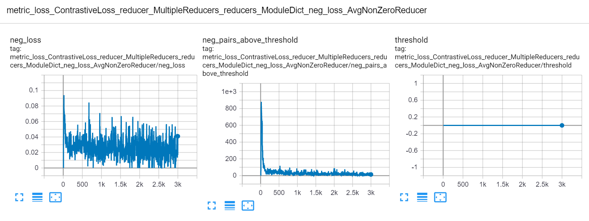

# Powerful Benchmarker

## Google Colab Examples
See the [examples folder](https://github.com/KevinMusgrave/powerful-benchmarker/tree/metric-learning/examples) for notebooks that give an overview of how to use this library.

## Installation
```bash
pip install powerful-benchmarker
```

## Modules that can be benchmarked
See [the list of default modules](modules.md). You can add other classes and modules by using the [register functionality](custom.md).


## Getting started

### Set default flags

The easiest way to get started is to download the [example script](https://github.com/KevinMusgrave/powerful-benchmarker/blob/metric-learning/examples/run.py). Then change the default values for the following flags (each one should be an absolute file path, not a relative path):

- ```pytorch_home``` is where you want to save downloaded pretrained models.
- ```dataset_root``` is where your datasets will be downloaded, or where they are already located.
- ```root_experiment_folder``` is where you want all experiment data to be saved.

### Try a basic command
The following command will run an experiment using the [default config files](https://github.com/KevinMusgrave/powerful-benchmarker/tree/metric-learning/src/powerful_benchmarker/configs), as well as download the CUB200 dataset into your ```dataset_root```
```bash
python run.py --experiment_name test1 --dataset {CUB200: {download: True}}
```
If the code runs properly, you'll see training and testing progress like this:


### Experiment folder format
Experiment data is saved in the following format:
```
<root_experiment_folder>
|-<experiment_name>
  |-configs
  |-<split scheme name>
    |-saved_models
    |-saved_csvs
    |-tensorboard_logs
  |-meta_logs
    |-saved_csvs
    |-tensorboard_logs
```

Here's what's in each subfolder:

- ```configs``` contains the yaml config files necessary to reproduce the experiment.
- ```<split scheme name>/save_models``` contains saved pytorch models for a particular split scheme. (A split scheme simply refers to the way train/val/test splits are formed.)
- ```<split scheme name>/saved_csvs``` contains CSV files with data collected during training. It also contains an SQLite database file with the same data.
- ```<split scheme name>/tensorboard_logs``` contains the same information in ```<split scheme name>/saved_csvs```, but in tensorboard format.
- ```meta_logs/saved_csvs``` contains CSV files for aggregate and ensemble accuracies. It also contains an SQLite database file with the same data.
- ```meta_logs/tensorboard``` contains the same information in ```meta_logs/save_csvs```, but in tensorboard format.

### View experiment data
There are multiple ways to view experiment data:

#### Tensorboard
Go to the ```<experiment_name>``` folder, and run tensorboard at the command line: 
```bash
tensorboard --logdir=. --port=12345
```
Then in your web browser, go to ```localhost:<port>```, where ```<port>``` is specified in the tensorboard command. You'll see plots like this:


#### CSV
Use any text editor or spreadsheet program to view the csv files that are saved in the ```saved_csvs``` folders.

#### SQLite
Use [DB Browser](https://sqlitebrowser.org/) to open the database files that are saved in the ```saved_csvs``` folders.


### Resume training
You can interrupt the program and resume training at a later time:
```bash
python run.py --experiment_name test1 --resume_training latest
```

You can also resume using the model with the best validation accuracy:
```bash
python run.py --experiment_name test1 --resume_training best
```

### Keep track of changes
Let's say you finished training for 100 epochs, and decide you want to train for another 50 epochs, for a total of 150. You would run:
```bash
python run.py --experiment_name test1 --resume_training latest \
--num_epochs_train 150 --merge_argparse_when_resuming
```
(The ```merge_argparse_when_resuming``` flag tells the code that you want to make changes to the original experiment configuration. If you don't use this flag, then the code will ignore your command line arguments, and use the original configuration. The purpose of this is to avoid accidentally changing configs in the middle of an experiment.)

Now in your experiments folder you'll see the original config files, and a new folder starting with ```resume_training```.
```
<root_experiment_folder>
|-<experiment_name>
  |-configs
    |-resume_training_config_diffs_<underscore delimited numbers>
  ...
```
This folder contains all differences between the originally saved config files and the parameters that you've specified at the command line. In this particular case, there should just be a single file ```config_general.yaml``` with a single line: ```num_epochs_train: 150```. 

The underscore delimited numbers in the folder name indicate which models were loaded for each [split scheme](#creating-splits-for-cross-validation). For example, let's say you are doing cross validation with 3 folds. The training process has finished 50, 30, and 0 epochs of folds 0, 1, and 2, respectively. You decide to stop training, and resume training with a different batch size. Now the config diff folder will be named ```resume_training_config_diffs_50_30_0```.

### Reproduce an experiment
To reproduce an experiment, use the ```--reproduce_results``` flag, and pass in the path to the experiment folder you want to reproduce:
```bash
python run.py --reproduce_results <experiment_to_reproduce> \
--experiment_name <your_experiment_name>
```
This will run an experiment based on the config files in ```experiment_to_reproduce```. You can make modifications to the configuration at the command line, as long as you provide the ```--merge_argparse_when_resuming``` flag, so that the code knows you intend on making changes:

```bash
# reproduce the experiment but use a different number of dataloaders
python run.py --reproduce_results <experiment_to_reproduce> \
--experiment_name <your_experiment_name> \
--trainer~APPLY~2: {dataloader_num_workers: 16} \
--tester~APPLY~2: {dataloader_num_workers: 16} \
--merge_argparse_when_resuming
```

For a guide on how to reproduce the results of [A Metric Learning Reality Check](https://arxiv.org/abs/2003.08505), see the [supplementary material](../papers/mlrc)

### Evaluating on specific splits
By default, your model will be saved and evaluated on the validation set every ```save_interval``` epochs. To get accuracy for specific splits, use the ```--splits_to_eval``` flag and pass in a python-style list of split names: ```--splits_to_eval [train, test]```. 

To run evaluation only, use the ```--evaluate``` or ```--evaluate_ensemble``` flag.

### Cross validation split schemes

In this library, splits are not hard-coded into the dataset classes. Instead, train/val/test splits are created by a ```SplitManager```, as specified in the ```config_dataset``` file:
```yaml
split_manager:
  ClassDisjointSplitManager:
    test_size: 0.5
    test_start_idx: 0.5
    num_training_partitions: 4
    num_training_sets: 4
```
This particular configuration will set aside the second 50% of classes for the test set. Then the first 50% of classes will be used for 4-fold cross validation, in which the train and val splits are always class-disjoint.


## Advanced usage
Here are some other important features of this library:

- The powerful [command line syntax](cl_syntax.md) that allows you to easily override, modify, merge, and delete config options at the command line, and within yaml files.
- Easy and flexible [hyperparameter optimization](hyperparams.md)
- The ability to [add custom modules](custom.md), without having to delve into the benchmarking code.

